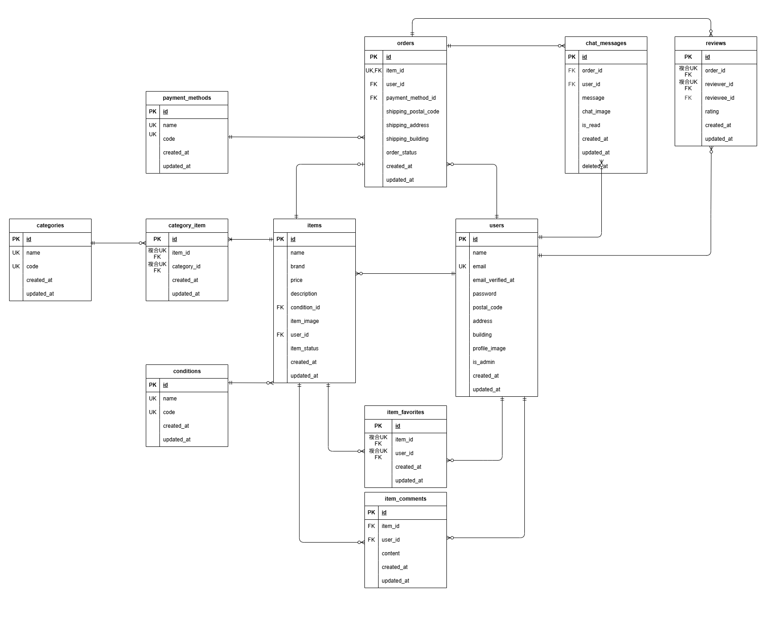

# KOTECH MARKET

## 環境構築

1. リポジトリをクローン

    ```bash
    git clone git@github.com:kawamata-natsuki/fleamarket-app.git
    ``` 
<br>  

2. `.env` ファイルの準備（ Docker 用）

    ```bash
    cp .env.docker.example .env
    ```
    ※この `.env` は Docker ビルド用の設定ファイルです（ Laravelの `.env` とは別物です）。  
      以下のコマンドで自分の UID / GID を確認し、自分の環境に合わせて `.env` の UID / GID を設定してください：
      ```bash
      id -u
      id -g
      ```
<br>

3. `docker-compose.override.yml`の作成

    `docker-compose.override.yml` は、開発環境ごとの個別調整（ポート番号の変更など）を行うための設定ファイルです。  
    以下のコマンドでファイルを作成し、必要に応じて内容を編集してください：
    ```bash
    touch docker-compose.override.yml
    ```
    ```yaml
    services:
      nginx:
        ports:
          - "8090:80"  # ポートが競合する場合に各自調整
          
      phpmyadmin:
        ports:
          - 8091:80  # ポートが競合する場合に各自調整
    ```
<br>

4. Docker イメージのビルドと起動

    以下のコマンドで Docker イメージをビルドし、コンテナを起動します：
    ```bash
    docker-compose up -d --build
    ```
    
    ※ Mac の M1・M2 チップの PC の場合、 `no matching manifest for linux/arm64/v8 in the manifest list entries` のメッセージが表示されビルドができないことがあります。  
    エラーが発生する場合は、 `docker-compose.yml` ファイルの `mysql` に以下のように追記してください：
    ```yaml
    mysql:
        platform: linux/x86_64  # この行を追加
        image: mysql:8.0.26
        environment:
    ```
<br>

5. Laravel のセットアップ

    Laravel の依存パッケージをインストールします：
    ```bash
    docker compose exec php bash
    composer install
    ```
<br>

6. `.env` ファイルの設定  

    ---

    `.env` ファイルの準備

    Laravel 用の環境設定ファイルを作成します：
    ```
    exit
    cd src
    cp .env.example .env
    ```

    ---

    メール設定
 
    メール認証は Mailtrap を使用します。  
    Mailtrap のアカウントを作成し、受信箱に記載される `MAIL_USERNAME` と `MAIL_PASSWORD` を `.env`設定してください：  
    ```ini
    MAIL_MAILER=smtp
    MAIL_HOST=sandbox.smtp.mailtrap.io
    MAIL_PORT=2525
    MAIL_USERNAME=your_mailtrap_username_here
    MAIL_PASSWORD=your_mailtrap_password_here
    MAIL_ENCRYPTION=null
    MAIL_FROM_ADDRESS=no-reply@example.com
    MAIL_FROM_NAME="${APP_NAME}"  
    ```

    ---

    Stripe 設定

    Stripe に登録し、テスト用 API キーを取得して `.env` に設定します：
    ```ini
    STRIPE_KEY=your_stripe_public_key_here
    STRIPE_SECRET=your_stripe_secret_key_here
    ``` 

    ---

    補足： Stripe テストカード番号（決済テスト用）

    > 成功：4242 4242 4242 4242  
    > 失敗：4000 0000 0000 9995  
    > 有効期限：任意の未来日（例：04/34）  
    > CVC：適当な3桁（例：123）

    ---
<br>

7.  権限設定

    本模擬案件では Docker 内で `appuser` を作成・使用しているため、基本的に `storage` や `bootstrap/cache` の権限変更は不要です。  
    ただし、ファイル共有設定やOS環境によっては権限エラーになる場合があります。  
    その場合は、以下のコマンドで権限を変更してください：
    ```bash
    sudo chmod -R 775 storage
    sudo chmod -R 775 bootstrap/cache
    ```
<br>

8.  アプリケーションキーの生成

    ```bash
    docker compose exec php bash
    php artisan key:generate
    ```
<br>

9.  マイグレーションの実行 

    ```bash
    php artisan migrate
    ```
<br>

10. シーディングの実行

    ```bash
    php artisan db:seed
    ```
<br>

11. ストレージのシンボリックリンク作成

    `public/storage` を `storage/app/public` にリンクするためのコマンドです。  
    画像ファイルを`storage/app/public/items/abc.jpg`に保存しておくと、ブラウザから`http://localhost/storage/items/abc.jpg`のようにアクセス可能になります。
    ```bash
    php artisan storage:link
    ```
<br>

12. ブラウザで動作確認
http://localhost:{NGINX_PORT}/login  
※ {NGINX_PORT} は `docker-compose.override.yml` で設定したポート番号です（デフォルトは8080）。
## 使用技術(実行環境)
- Laravel Framework 8.83.29
- PHP 8.2.28
- MYSQL 8.0.26
- Nginx 1.21.1
- phpMyAdmin 8.2.27


## ER図
最新のER図を更新しました（2025年7月28日）。



## URL
- 開発環境 ：http://localhost:{NGINX_PORT}  
- データベース：http://localhost:{PHPMYADMIN_PORT}  
※ {NGINX_PORT}や {PHPMYADMIN_PORT}は `docker-compose.override.yml` で各自の環境に合わせて調整してください。

## テスト実行方法まとめ

### Featureテスト（PHPUnit）

テストケース ID11 「支払方法選択機能」は JavaScript を含むため、 Dusk による E2E テストは導入せず、 Feature テスト＋手動によるブラウザ確認で対応しています。　

1. `.env.testing.example` をコピーして `.env.testing` を作成：

   ```bash
   cp .env.testing.example .env.testing
   ```

    ※ `.env.testing.example` はテスト専用の設定テンプレートです。

2. テスト用データベースにマイグレーションを実行：

    ```
    php artisan migrate --env=testing
    ```

3. テスト実行：

    ```
    php artisan test tests/Feature
    ```

### 画像アップロードのテストについて

本模擬案件では画像アップロードのテストに  
`UploadedFile::fake()->image(...)`
を使用しています。  
そのため、 PHP の GD ライブラリが必要となりますが、 Dockerfile で既にインストール済みのため、追加対応は不要です。


## ダミーデータの作成について【2025年7月28日 更新】
本番環境で必要な初期データは、すべて `DatabaseSeeder.php` に登録済みです。  

| 種別 | Seeder |
|------|--------|
| 商品情報 | `ItemSeeder` |
| 商品カテゴリ | `CategorySeeder` |
| 商品状態 | `ConditionSeeder` |
| 支払方法 | `PaymentMethodSeeder` |
| ユーザー情報 | `UserSeeder` |

※ 販売ステータス（on_sale / sold_out） と 取引ステータス（ `pending` / `completed_pending` / `completed`）については、マスタテーブルとして管理していないため、  
- `ItemStatus.php`
- `OrderStatus.php`
にて定数として管理しています。

---

1. 商品情報

    仕様書に記載された10商品をダミーデータとして作成。  
    - 一般ユーザー①：商品データCO01～CO05を出品
    - 一般ユーザー②：商品データCO06～CO10を出品  
    ※画像ファイル名はすべて英数字に変更済み  

2. 商品カテゴリ情報

    - `CategoryConstants.php` にカテゴリコード・名称を定義  
    - `CategorySeeder` によりマスタ登録
    - `CategoryRepository` を通じて取得・表示に使用

3. ユーザー情報

    `UserSeeder` により、以下のユーザーが自動生成されます：

    | 種別 | 内容 |
    |------|------|
    | 一般ユーザー | 3名（名前・住所などはダミーデータ） |
    | 管理者ユーザー | 1名（※管理画面がないため、ログイン確認用） |

4. その他マスタ情報

    - **商品状態**  
        `ConditionConstants.php` に状態コード・名称を定義  
        `ConditionSeeder` によりマスタ登録
        `ConditionRepository` を通じて取得・表示に使用
    
    - **支払方法**  
        `PaymentMethodConstants.php` に支払方法コード・名称を定義   
        `PaymentMethodSeeder` によりマスタ登録
        `PaymentMethodRepository` を通じて取得・表示に使用
    
    - **販売ステータス**  
        `ItemStatus.php` にて定数として管理しています。

    - **取引ステータス**  
        `OrderStatus.php` にて定数として管理しています。 


## ログイン情報一覧【2025年7月28日 更新】

※ログイン確認用のテストアカウントです。  
※管理者ユーザーは管理画面が存在しないため、ログイン確認用アカウントとしてのみ作成しています。


- 一般ユーザー①：商品データCO01～CO05を出品
- 一般ユーザー②：商品データCO06～CO10を出品
- 一般ユーザー③：出品商品なし

| ユーザー種別     | メールアドレス         | パスワード   |
|------------------|--------------------------|--------------|
| 一般ユーザー①    | mario@example.com         | 12345678     |
| 一般ユーザー②    | link@example.com          | 12345678     |
| 一般ユーザー③    | pupupu@example.com        | 12345678     |
| 管理者ユーザー   | admin@example.com         | admin1234    |


## 【補足】バリデーションエラーについて
全項目に `string` を指定し、不正な配列入力などを防止しています。  
また、テーブル設計に基づいたルールを適宜追加し、それに合わせたエラーメッセージもカスタムしています。

### 会員登録画面（ `RegisterRequest.php` にて定義）
- **name** 
  - `required`
  - `max:50`：レイアウト崩れ防止のため
- **email**  
  - `max:255`
  - `unique:users,email`：既存ユーザーと重複しないようにチェック
- **password** 
  - `confirmed`：確認用パスワードとの一致チェック
- **password_confirmation**
  - `required`：入力欄の直下にエラー表示するため

### 商品購入画面（ `PurchaseRequest.php` にて定義）
- **payment_method**
  - `in`：指定された支払い方法以外が送られてくるのを防ぐため

### 送付先住所変更画面（ `AddressRequest.php` にて定義）
- **building**
  - `nullable`：基本設計書では入力必須になっていましたが、建物名がないユーザーもいるため

### プロフィール編集画面（ `ProfileRequest.php`にて定義 ）
- **profile_image**
  - `image`：拡張子だけでなく、ファイルの中身が本当に画像かどうかも検証するため

### 商品出品画面（ `ExhibitionRequest.php`にて定義 ）
- **name**
  - `max:40`：レイアウト崩れ防止のため
- **item_image**
  - `image`：拡張子だけでなく、ファイルの中身が本当に画像かどうかも検証するため
- **category_codes**
  - `array`：カテゴリーを複数選択できる仕様のため
  - `distinct`：同じカテゴリが重複して送られてこないようにチェック
  - `in`：指定されたカテゴリコード以外が送られてくるのを防ぐため
- **condition_code**
  - `in`：指定された状態コード以外が送られてくるのを防ぐため
- **price**
  - `max:9999999`：サービス内で想定される取引価格の上限に合わせ、異常な価格やレイアウト崩れを防ぐため
- **brand**
  - `nullable`：任意入力のため
  - `max:100`：レイアウト崩れ防止のため


## 【補足】プレースホルダーについて
プレースホルダーはUI補助として追加しています。  
※この仕様追加については、クライアント（コーチ）に事前相談し、了承を得ています。

### 会員登録画面
- name                  ： 例：山田　太郎
- email                 ： 例：user@example.com
- password              ： 8文字以上のパスワードを入力
- password_confirmation ： もう一度パスワードを入力

### ログイン画面
- email                 ： 例：user@example.com
- password              ： 8文字以上のパスワードを入力


## 【補足】追加画面の実装について
仕様書には明記されていませんが、必要に応じて以下の画面を追加実装しています。  
※この仕様追加についてはクライアント（コーチ）に事前相談し、了承を得ています。

### 商品購入完了画面の追加作成
ユーザーの操作完了を明示するために、「購入完了画面（`purchase-success.blade.php`）」を実装しています。  
購入完了メッセージとともに、以下のリンクを表示しています：
- トップページへ戻る
- 購入履歴を見る  

### 商品購入キャンセル画面の追加作成
ユーザーがStripe画面でキャンセル操作を行った場合に表示される「購入キャンセル画面（`purchase-cancel.blade.php`）」を実装しています。  
購入キャンセルのメッセージとともに、以下のリンクを表示しています：
- トップページへ戻る

### 商品購入無効画面の追加作成
購入済みの商品に対して購入処理が行われた場合のエラー対応として、「購入無効画面（`purchase-invalid.blade.php`）」を実装しています。  
購入処理不可のメッセージとともに、以下のリンクを表示しています：
- トップページへ戻る


## 【補足】商品購入画面について
### FN023 支払い方法選択機能について
- 仕様書では「小計画面で変更が即時反映される」と記載されていましたが、 HTML および Laravel のサーバー処理だけでは実現が難しかったため、 JavaScript を使用して実装しています。  
※この仕様追加についてはクライアント（コーチ）に事前相談し、了承を得ています。  

- Stripe ではコンビニ支払いを選択した場合、30万円を超える商品の購入ができないという仕様があるため、バリデーションエラーとして処理しています。  
この制約に対応するため、ビジネスロジックを`OrderController`内に実装しています。

- 決済処理の実装にあたり、 Stripe との連携処理を`app/Services/StripeService.php`にまとめています。


## 【補足】プロフィール編集画面について
### FN027 プロフィール画像について
- 仕様書には記載がありませんが、ユーザー体験の向上を目的として、プロフィール画像を選択した際に即時プレビュー表示されるように JavaScript を使用して実装しています。  
- また、同じくユーザー体験を考慮し、選択した画像をトリミングできる機能も JavaScript を使用して追加実装しています。  
※この仕様追加についてはクライアント（コーチ）に事前相談し、了承を得ています。


## 【補足】ヘッダーロゴのリンク対応
仕様書には明記されていませんが、ユーザーがトップページに戻りやすくなるよう、  
ヘッダーロゴにトップページへのリンクを追加しています。  
※この仕様追加についてはクライアント（コーチ）に事前相談し、了承を得ています。


## 【補足】 検索機能について（機能要件 FN016 ）
- Figma上のデザインには検索窓のみで検索ボタンはありませんでしたが、  
リアルタイム検索の実装が難しかったため、明示的な検索ボタンを追加しています。  
ユーザーがキーワード入力後に確実に検索を実行できるよう、UXを重視した対応です。  
※この仕様追加についてはクライアント（コーチ）に事前相談し、了承を得ています。  

- また、1文字のみの検索だと、濁点・半濁点の違い（例：ぐ／く、ぴ／ひ）によって意図しない検索結果が出るため、  
部分一致検索は2文字以上で実行されるように制限しています。  

## 【補足】商品出品画面について
### FN029 商品画像のアップロード
- Figma上のデザインから、ドラッグ＆ドロップによる画像アップロードが可能な仕様と判断し、JavaScriptを使用して実装しています。  
仕様書には明記されていませんが、ユーザー体験の向上を目的として、選択した商品画像の即時プレビュー表示も実装しました。  
※この仕様追加についてはクライアント（コーチ）に事前相談し、了承を得ています。

- また、大きな画像（〜10MB）をアップロードできるように、
nginx の設定ファイル（`nginx/default.conf`）にて以下のように設定しています  

  ```nginx
  client_max_body_size 10M;
  ```


## 画面レイアウトについて
### 購入済商品の表示について（機能要件 FN014 / FN015）
購入済みの商品は、SOLDの表示に加えて、商品画像が暗くなるようにしています。  
※この仕様追加についてはクライアント（コーチ）に事前相談し、了承を得ています。

### 商品名の表示について（機能要件 FN014）
商品名は最大40文字まで登録可能ですが、一覧表示で全て表示するとレイアウトが崩れるため、一覧画面では商品名を1行で省略表示（末尾に「…」を付けて）する仕様としています。  
商品詳細画面では全文を表示しています。

### 商品詳細画面での購入済商品の表示について
購入済みの商品は、「購入手続きへ」ボタンの代わりに「SOLD OUT」ボタンを表示し、  
クリック無効に切り替えています。

### 商品詳細画面でのコメントの表示について（機能要件 FN020）
仕様書には明記されていませんが、コメントのヘッダーに投稿日時を表示するようにしています。  
※この仕様追加についてはクライアント（コーチ）に事前相談し、了承を得ています。


## 【補足】追加機能について【2025年7月28日 更新】
- 以下の機能を新たに実装しました。
    - 取引チャット機能
    - 評価機能
    - 取引完了通知機能  
- 今回の追加機能により、購入者と出品者が取引後もスムーズにコミュニケーションをとれ、評価を通じてユーザー同士の信頼度を可視化し、円滑な取引に繋がるようになっています。  
---

### US001：取引チャット機能
- **FN001：取引中商品確認機能**  
  - マイページから取引中の商品と未読チャット件数を確認できるメニュータブを追加しています。   
  - 未読チャットが 99 件以上になると「99+」と表示し、アイコンのレイアウトが崩れないよう調整しています。   

- **FN002：取引チャット遷移機能**  
  - 取引中の商品をクリックすると取引チャット画面へ遷移します。 

- **FN003：別取引遷移機能**  
  - 取引チャット画面のサイドバーから他の取引に切り替え可能です。  
  - 選択中の商品は色を変えて、どの取引を表示しているか一目でわかるようにしています。  
  - サイドバーはチャットが長くなっても常に見えるよう固定し、スムーズに取引を切り替えられるようにしています。  

- **FN004：取引自動ソート機能**  
  - 取引中の商品は新着メッセージのある順に並び替えて表示します。  
  - マイページだけでなく、取引チャット画面のサイドバーも同様に並び替えて表示されます。

- **FN005：新規通知表示機能**  
  - 未読メッセージがある商品に通知マークを表示し、件数も確認できます。
  - 未読チャットが 99 件以上になると「99+」と表示し、アイコンのレイアウトが崩れないよう調整しています。  
  - 未読アイコンを見やすくするため、初回模擬案件で使用していた SOLDOUT 表示のレイアウトも変更しました。  

---

### US002：取引評価機能
- **FN005：評価平均確認機能**  
  - プロフィール画面で取引相手からの評価平均が表示（四捨五入）されます。評価がない場合は非表示です。
  - ユーザーは相手の取引実績を確認することができ、安心して取引が行えます。  

---

### US002：取引チャット投稿機能
- **FN006：取引チャット機能**  
  - 購入者・出品者がメッセージ本文と画像を投稿可能です。  
  - 画像は PC（幅 1400〜1540px）ではプレビューを表示し、タブレット（幅 768〜850px）ではファイル名のみ表示するようにしています。
  - 投稿したメッセージは画面右上に自動スクロールされるよう調整しています。  

- **FN007：バリデーション**  
  - 本文：必須・最大400文字  
  - 画像：`.jpeg`または`.png`

- **FN008：エラーメッセージ表示**  
  - 入力フォーム上部にエラーメッセージが表示されます。

- **FN009：入力情報保持**  
  - 他画面に遷移しても入力した本文が保持されます。

---

### US003：取引チャットの編集・削除
- **FN010：メッセージ編集機能**  
  - 投稿済みメッセージを編集できます。
  - 編集内容は即座に反映され、画面右上に自動スクロールされます。

- **FN011：メッセージ削除機能**  
  - 投稿済みメッセージを削除できます。  
  - 削除後はメッセージリストが自動で詰められ、レイアウト崩れを防ぐように調整しています。

---

### US004：取引後のレビュー評価
- **FN012：評価機能（購入者）**  
  - 取引完了ボタンから出品者を評価できます。  
  - 取引完了ボタンは一度しか押せないように制御しています。  
  - 取引完了ボタンを押すと出品者へメールを送ると同時に、購入者はモーダル画面からレビューが可能です。  
  - ブラウザの戻るボタンを押しても処理が進まないように調整しています。  
  - 購入者はレビュー後、出品者がレビューを終えるまで取引中の商品タブから、取引チャットを行うことができます。  

- **FN013：評価機能（出品者）**  
  - 購入者が取引完了後、出品者は取引チャット画面もしくは通知メールから購入者を評価できますが、どちらか一方から1回しかレビューできないように制御しています。  
  - 両者がレビューを終えるまで、レビューは表示されないように調整しています。  

- **FN014：評価送信後の遷移**  
  - 評価送信後は商品一覧画面へリダイレクトします。  
  - ユーザーがわかりやすいように、フラッシュメッセージを表示しています。
  -  両者のレビューが完了した後は、取引チャット画面は現状閲覧不可の仕様となっています。   

---

### US005：取引完了通知メール
- **FN015：メール送信（Mailtrap）**  
- **FN016：通知メール送信機能**  
  - 購入者が取引を完了すると出品者へ通知メールを自動送信されます。  
  - 出品者は通知メールから取引チャット画面へ遷移し、レビュー投稿が可能です。   
  - 出品者がマイページからレビューを投稿した場合はモーダルは表示されず、商品一覧画面へリダイレクトされます。    
  未レビューの場合のみ、モーダルが表示されるように制御しています。   
  - メールは HTML タイプとテキストタイプの2種類を用意しています。
  - メール内容
  > {{ 商品名 }}の取引が完了しました。  
  > レビューをお願いします。  
  > 取引画面を開く  
  > このメールはシステムから自動送信されています。返信は不要です。


## 今後の改善予定
- チャットのリアルタイム通知  
  現状はページを再読み込みしないと新着メッセージが反映されないため、リアルタイム更新対応を検討。  

- レビュー機能の拡張  
  星評価に加えて、コメント（テキストレビュー）も投稿可能にする。  

- 取引チャットの閲覧権限改善  
  取引完了・レビュー完了後も、購入者と出品者が過去のチャット履歴を参照できるようにする。  

- ページネーション導入  
  商品一覧ページ、マイページの商品リストにページネーションを実装し、表示速度やUXを改善。

- リアルタイム検索  
  商品一覧で検索キーワード入力と同時に結果を絞り込めるようにする。

- 未読チャット通知の可視化  
  トップページヘッダーやアイコンに未読メッセージ数を表示することで、通知を見逃さないようにする。  

- レスポンシブ対応（スマホ最適化）  
  スマートフォン用デザインを調整し、操作性を向上。